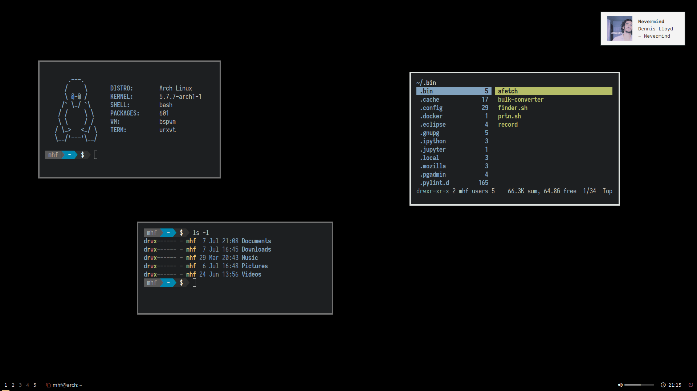

              ▄▄                         ▄▄▄▄      ██     ▄▄▄▄
              ██              ██        ██▀▀▀      ▀▀     ▀▀██
         ▄███▄██   ▄████▄   ███████   ███████    ████       ██       ▄████▄   ▄▄█████▄
        ██▀  ▀██  ██▀  ▀██    ██        ██         ██       ██      ██▄▄▄▄██  ██▄▄▄▄ ▀
        ██    ██  ██    ██    ██        ██         ██       ██      ██▀▀▀▀▀▀   ▀▀▀▀██▄
        ▀██▄▄███  ▀██▄▄██▀    ██▄▄▄     ██      ▄▄▄██▄▄▄    ██▄▄▄   ▀██▄▄▄▄█  █▄▄▄▄▄██
          ▀▀▀ ▀▀    ▀▀▀▀       ▀▀▀▀     ▀▀      ▀▀▀▀▀▀▀▀     ▀▀▀▀     ▀▀▀▀▀    ▀▀▀▀▀▀

## Setup Description

```
Distro		➔ Arch Linux
WM		➔ Bspwm
Shell		➔ Bash
Font		➔ Iosevka Term
Notification	➔ Dunst
Terminal	➔ Urxvt
File Manager	➔ Ranger
Bar		➔ Polybar
Wallpaper	➔ Hsetroot
Volume Control	➔ Pavucontrol
Text Editor	➔ Nvim
Media Player	➔ Mpv
Music Player	➔ Spotify
Browser		➔ Firefox
Pdf Viewer	➔ Zathura
Image Viewer	➔ Sxiv
Bittorrent	➔ Transmission
```



